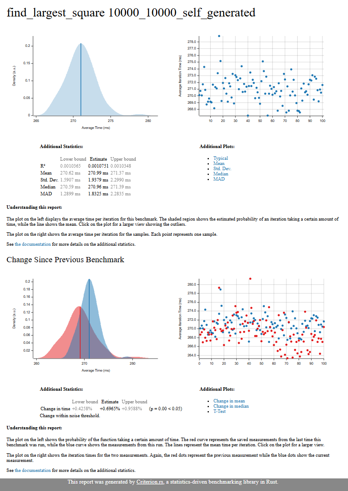
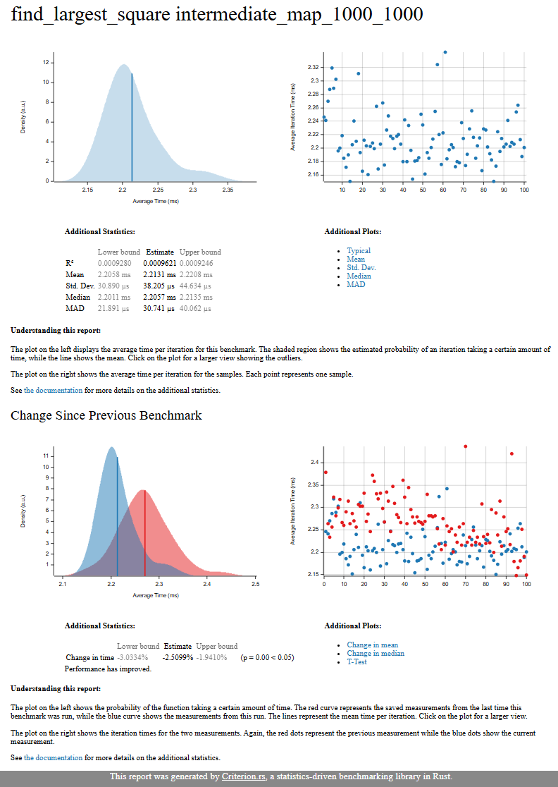
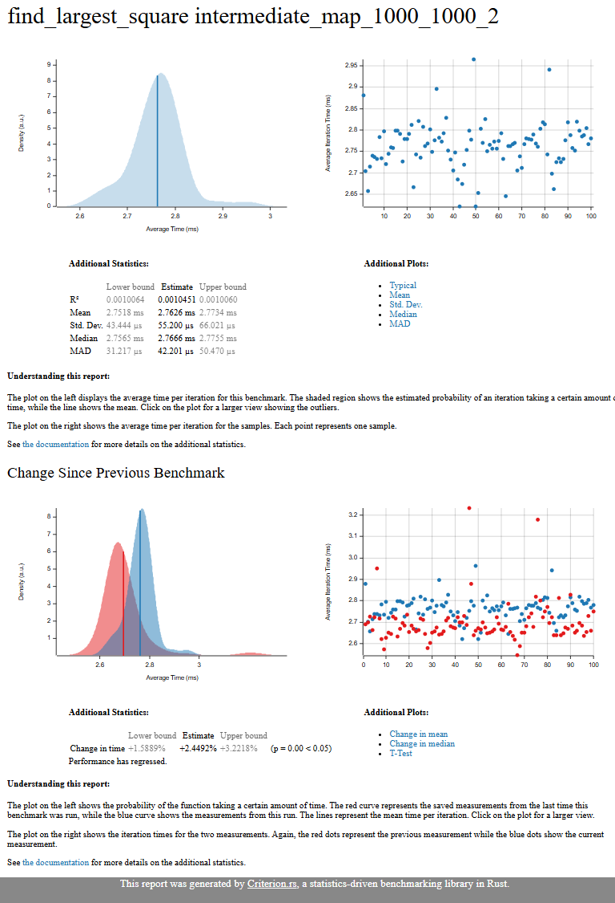

# Largest Square Finder - BSQ made in rust 🚀

---

## How It Works

1. **Input File Format**:
    - The first line specifies the number of rows in the grid.
    - The subsequent lines represent the grid itself, where each line has the same length (number of columns).

   Example:
   ```
   4
   ..o.
   .o..
   ....
   ...o
   ```

2. **Dynamic Programming**:
    - A 1D `dp` array is used to store the size of the largest square ending at each cell.
    - The algorithm iterates through the grid, updating the `dp` array based on the values of the left, top, and diagonal neighbors.

3. **Output**:
   - It displays the grid with the largest square replaced by `x`.

---

## Usage

### Prerequisites

- Rust installed on your system. If not, install it from [rustup.rs](https://rustup.rs/).

### Steps

1. **Clone the Repository**:
   ```bash
   git clone https://github.com/GodlyJaaaj/bsq-rs.git
   cd largest-square-finder
   ```

2. **Prepare the Input File**:
   Create a text file (e.g., `input.txt`) with the grid data. Example:
   ```
   4
   ..o.
   .o..
   ....
   ...o
   ```

3. **Run the Program**:
   ```bash
   cargo run --release -- input.txt
   ```

4. **Output**:
   The program will display:
    - The grid with the largest square replaced by `x`.

   Example output:
   ```
   ..o.
   .o..
   .xx.
   .xxo
   ```
---

## What next?

- [ ] Get rid of unnecessary UTF-8 encoding of rust string
- [ ] Print the whole result as a single string (1 write) instead of printing each line one by one

---

## Results using criterion rs



---



---



---